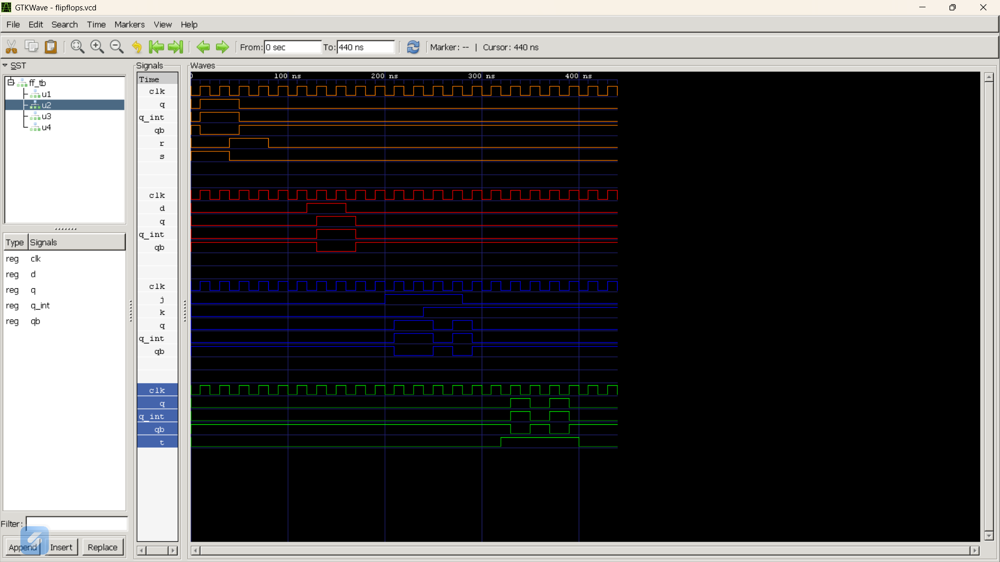

# Lab 7: VHDL Code for Sequential Circuits – Flip-Flops

## Objective
- Design and simulate **SR Flip-Flop** using VHDL.
- Design and simulate **D Flip-Flop** using VHDL.
- Design and simulate **JK Flip-Flop** using VHDL.
- Design and simulate **T Flip-Flop** using VHDL.
- Verify the functionality of all flip-flops using **GHDL** and **GTKWave**.

---

## Theory

A **Flip-Flop** is a bistable sequential circuit capable of storing **one bit** of information. Unlike combinational circuits, a flip-flop depends on both the current input and the previous output. Flip-flops are generally triggered by the **rising edge of a clock signal** and are widely used in registers, counters, memory devices, and sequential digital systems.

### SR Flip-Flop
The SR (Set-Reset) Flip-Flop has two inputs: **S (Set)** and **R (Reset)**.
- S = 1, R = 0 → Set (Q = 1)
- S = 0, R = 1 → Reset (Q = 0)
- S = 0, R = 0 → Hold previous state
- S = 1, R = 1 → Invalid/Forbidden state

### D Flip-Flop
The D (Data) Flip-Flop transfers the value present at the **D input** to the output **Q** on every rising edge of the clock.

### JK Flip-Flop
The JK Flip-Flop removes the invalid state of the SR Flip-Flop.
- J = 0, K = 0 → Hold
- J = 0, K = 1 → Reset
- J = 1, K = 0 → Set
- J = 1, K = 1 → Toggle

### T Flip-Flop
The T (Toggle) Flip-Flop changes its output whenever **T = 1** at the rising edge of the clock.
- T = 0 → Hold
- T = 1 → Toggle

---

## Files Included

- `sr_ff.vhd`
- `d_ff.vhd`
- `jk_ff.vhd`
- `t_ff.vhd`
- `ff_tb.vhd`

---

## GHDL Commands

```bash
ghdl -a sr_ff.vhd d_ff.vhd jk_ff.vhd t_ff.vhd ff_tb.vhd
ghdl -e FF_TB
ghdl -r FF_TB --vcd=flipflops.vcd
gtkwave flipflops.vcd
```

---

## Expected Output

### SR Flip-Flop

| S | R | Q (Next) |
|---|---|----------|
| 0 | 0 | Hold |
| 0 | 1 | 0 |
| 1 | 0 | 1 |
| 1 | 1 | Invalid |

### D Flip-Flop

| D | Q (Next) |
|---|----------|
| 0 | 0 |
| 1 | 1 |

### JK Flip-Flop

| J | K | Q (Next) |
|---|---|----------|
| 0 | 0 | Hold |
| 0 | 1 | Reset |
| 1 | 0 | Set |
| 1 | 1 | Toggle |

### T Flip-Flop

| T | Q (Next) |
|---|----------|
| 0 | Hold |
| 1 | Toggle |

---

## Output (Screenshot)

### Combined Waveform of SR,D,JK and T flip-flop

---

## Discussion

In this experiment, four different flip-flops were designed and simulated using VHDL. The simulation results showed that each flip-flop behaved according to its characteristic truth table. The SR Flip-Flop performed set, reset, and hold operations, the D Flip-Flop transferred input data on the rising clock edge, the JK Flip-Flop successfully eliminated the invalid state by toggling when both inputs were high, and the T Flip-Flop toggled its output whenever the toggle input was active. The GTKWave waveforms confirmed the correct operation of all sequential circuits.

---

## Conclusion

The objectives of this lab were successfully achieved. The SR, D, JK, and T Flip-Flops were implemented, simulated, and verified using GHDL and GTKWave. The obtained waveforms matched the expected behavior, providing a clear understanding of sequential circuits and clock-triggered digital systems.