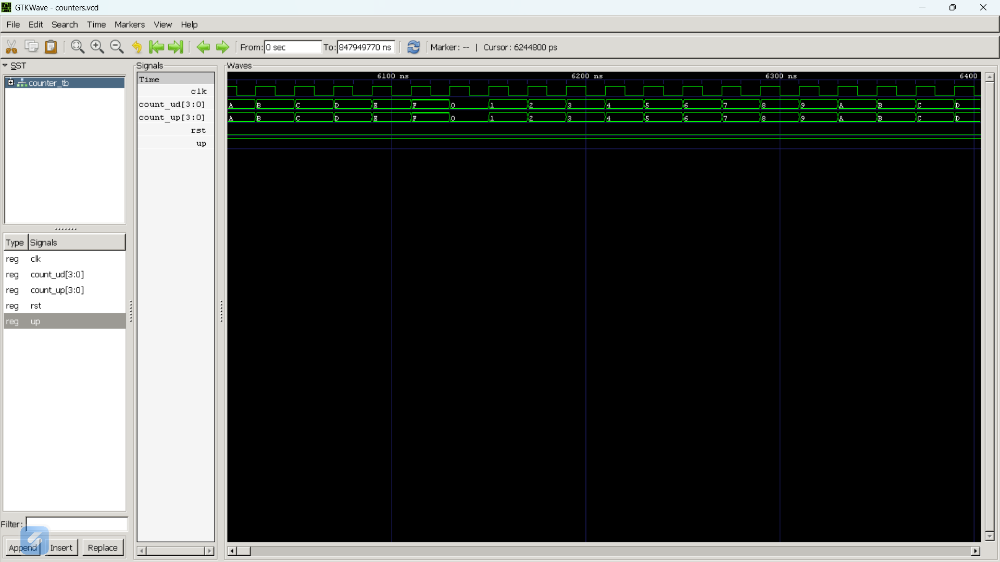

# Lab 8: VHDL Code for Sequential Circuits – Counters

## Objective
- To design and simulate a 4-bit synchronous up counter using VHDL.
- To design and simulate a 4-bit synchronous up/down counter using VHDL.
- To understand the operation of synchronous counters using clock signals.
- To verify the functionality of both counters through simulation.

## Theory
A counter is a sequential digital circuit that changes its state in response to clock pulses. Unlike combinational circuits, counters store their current state and update it on each clock edge.

A **4-bit Synchronous Up Counter** increments its binary count by one on every rising edge of the clock. Since all flip-flops receive the clock simultaneously, it operates faster and more reliably than an asynchronous counter.

A **4-bit Synchronous Up/Down Counter** can count in both increasing and decreasing order. The counting direction is controlled by the **UP** signal. When **UP = '1'**, the counter increments, and when **UP = '0'**, it decrements. An active-high reset signal clears the counter and sets the output to **0000**.

Synchronous counters are widely used in digital systems such as timers, event counters, frequency dividers, and digital clocks because of their speed and accuracy.

## Output

## Discussion and Conclusion
In this lab, a 4-bit synchronous up counter and a 4-bit synchronous up/down counter were successfully implemented using VHDL. The circuits were simulated using GHDL, and the waveforms were verified using GTKWave. The simulation showed correct counting, proper reset operation, and accurate change of counting direction based on the control signal. This experiment improved the understanding of sequential circuits and the practical implementation of synchronous counters in digital system design.